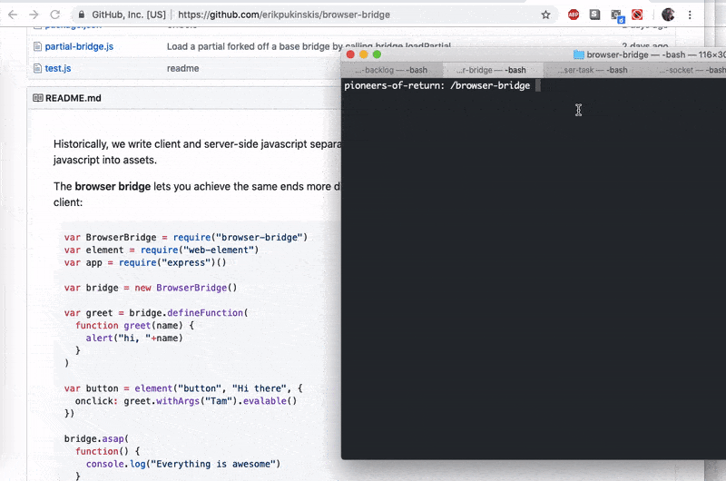

Do stuff in other peoples' browsers with **browser-task**.

Start a server:

```
cd ~
npm install browser-task
node browser-task/start
```

That should open `http://localhost:9777/browser` in your web browser, so that there is a worker in the queue available to do tasks.

Add a task with the API:

```javascript
var browserTask = require("browser-task")

var browser = browserTask(
  "http://localhost:9777",
  function() {
    browser.pressButton(".go", thenExpectSomething)})

function thenExpectSomething() {
  browser.assertText(".my-div", "BANG!",
  thenBeDone)}
  
function thenBeDone (){
  browser.done()}
```

## Methods

```
browser.assertHasClas("#my-selector", "some-class-name", callback)
browser.assertNoClass(...)
browser.pressButton("#some-button", callback)
browser.done()
```

### Screencast



### Notes

review every command, at least the first few for each user

flag things with adjectives

User 2354: [auto-declined message with prurient content]


### Why

 - you always get to a point when you want to pause the test and look in the browser anyway

 - it works on any browser you want, so you can use it for testing too
 
 - I will need it for screencasting tests, customer support, etc anyway

 - iframe stuff doesn't work in zombiejs. In general there are holes in the zombie/jsdom coverage

 - jsdom uses ES6. Also it is a nightmare.

 - zombie uses ws which uses bufferutils which compiles stuff and slows down npm installs dramatically
 
